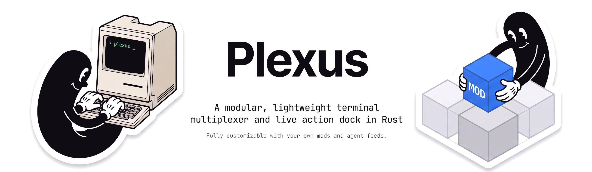
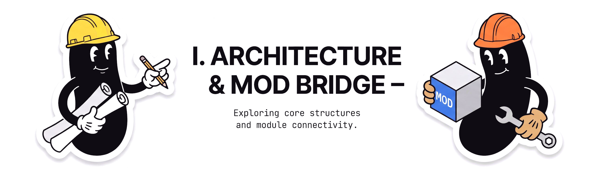
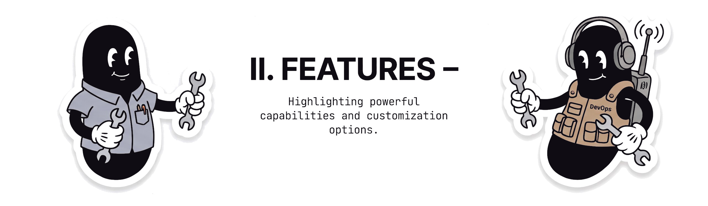
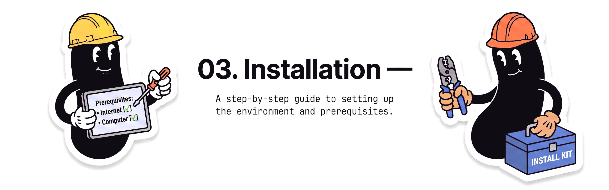
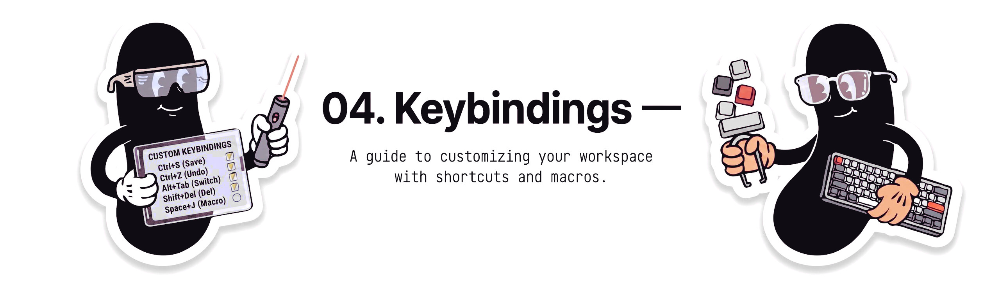
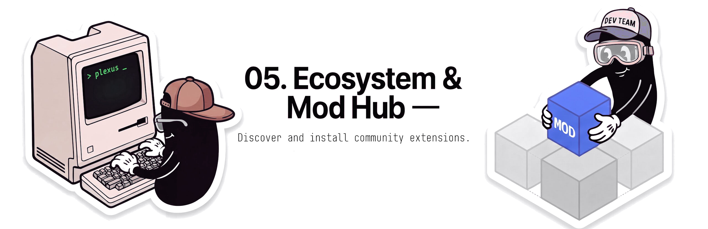

<p align="center">
  
</p>

<p align="center">
  <a href="https://github.com/Azertyuiop442/Plexus/releases"></a>
  <a href="https://github.com/Azertyuiop442/Plexus"></a>
  <a href="LICENSE.md"></a>
</p>

<p align="center">
  
</p>

<p align="center">
  
</p>

---

<a id="01-architecture--mod-bridge"></a>
<p align="center">
  
</p>

Plexus acts as a presentation shell decoupled from background logic. Companion mods and background services communicate non-blockingly via JSON file-IPC in `/tmp/cc-sidebar/`:

- `mods-data/<mod>.json`: Mods push live widgets, metrics, and modals.
- `mod-pickup.json`: Plexus routes user clicks and triggers back to the active mod.

<p align="center">
  
</p>

---

<a id="02-features"></a>
<p align="center">
  
</p>

<details align="center">
<summary align="center"><b>Click to expand technical features list</b></summary>
<div align="left">
<br/>

- **Decoupled Multiplexing**: Native Rust PTY terminal multiplexer with persistent tabs, background process isolation, and hot reload (<kbd>Ctrl</kbd>+<kbd>R</kbd>).
- **Data-Driven Mod Bridge**: Companion mods and background services push live widgets, metrics, and interactive modals via JSON IPC (`/tmp/cc-sidebar/`).
- **Autonomous Agent Skills**:
  - Install skill bundles directly from any GitHub repository URL.
  - Live remote git tracking: automatically checks upstream commit freshness and flags updates.
  - One-click in-app background updater with progress indicators and automatic context injection.
- **Configurable Sound Alerts**:
  - Audio cues on task completion and user intervention / permission prompts.
  - Native, zero-latency playback on macOS (`afplay`), Windows (`PowerShell` / SystemSounds), and Linux (`paplay` / `pw-play`).
  - Anti-duplication run latch and global debounce cooldown to eliminate audio overlap across multiple open terminals.
  - Dedicated configuration modal with live sound preview and test triggers.
- **Transient Error Recovery & Auto-Retry**:
  - Real-time classifier for provider rate limits (429), server outages (5xx), and network drops.
  - Configurable exponential backoff, jitter, and interrupt safety.
- **Live Usage Telemetry**:
  - Interactive 1-line ASCII gauge tracking usage limits (5-hour, weekly, and monthly quotas).
- **Self-Pulling Update Engine**:
  - In-app version detection with automatic fast-forward updates.

</div>
</details>

---

<a id="03-installation"></a>
<p align="center">
  
</p>

### One-Command Installer

- **macOS / Linux**:
```bash
curl -fsSL https://raw.githubusercontent.com/Azertyuiop442/Plexus/public/install.sh | bash
```

- **Windows (PowerShell)**:
```powershell
irm https://raw.githubusercontent.com/Azertyuiop442/Plexus/public/install.ps1 | iex
```

### Upgrading from v0.1.3

To upgrade to v0.1.4 and activate the self-pulling update engine, re-run the one-command installer above or run:
```bash
git -C ~/.commandcode/mods/cc-dashboard pull --ff-only origin public && bash ~/.commandcode/mods/cc-dashboard/install.sh
```

### Manual Build
```bash
git clone https://github.com/Azertyuiop442/Plexus.git ~/.commandcode/mods/cc-dashboard
cd ~/.commandcode/mods/cc-dashboard
bash install.sh
```

---

<a id="04-keybindings"></a>
<p align="center">
  
</p>

<details align="center">
<summary align="center"><b>Click to expand keyboard shortcuts table</b></summary>
<div align="center">
<br/>

| Shortcut | Action | Scope |
|:---:|---|:---:|
| <kbd>Ctrl</kbd> + <kbd>P</kbd> | Quick Switcher / Fuzzy Palette | `[Global]` |
| <kbd>Ctrl</kbd> + <kbd>O</kbd> | Process Tree Inspector | `[Global]` |
| <kbd>Ctrl</kbd> + <kbd>B</kbd> | Toggle Left Sidebar | `[Global]` |
| <kbd>Ctrl</kbd> + <kbd>D</kbd> | Toggle Right Panel Dock | `[Global]` |
| <kbd>Ctrl</kbd> + <kbd>M</kbd> | Maximize / Restore Dock | `[Global]` |
| <kbd>Ctrl</kbd> + <kbd>Space</kbd> | Context Menu | `[Active Pane]` |
| <kbd>Ctrl</kbd> + <kbd>T</kbd> · <kbd>+</kbd> | New Terminal Tab | `[Tab Bar]` |
| <kbd>Ctrl</kbd> + <kbd>W</kbd> · <kbd>x</kbd> | Close Tab | `[Active Tab]` |
| <kbd>Alt</kbd> + <kbd>1</kbd> .. <kbd>9</kbd> | Jump to Tab N | `[Tab Bar]` |
| <kbd>Ctrl</kbd> + <kbd>R</kbd> | Hot Reload Shell | `[Global]` |

</div>
</details>

---

<a id="05-ecosystem--mod-hub"></a>
<p align="center">
  
</p>

<p align="center">
  Discover and install community extensions on the <b><a href="https://github.com/Azertyuiop442/plexus-community-mods">Plexus Community Mods Hub</a></b>.
</p>

---

<h2 align="center">License</h2>

<p align="center">
  Source-available under the <a href="LICENSE.md">Fair &amp; Community License</a>. Free for personal, academic, and open-source use.
</p>

---

<h2 align="center">Reviews &amp; Ratings</h2>

<p align="center">
  <a href="https://peership.dev"></a>
  <br/><br/>
  Tested Plexus? Share your rating and review on PeerShip! <br/>
  <a href="https://peership.dev"><b>Leave your review for Plexus on peership.dev</b></a>
</p>
